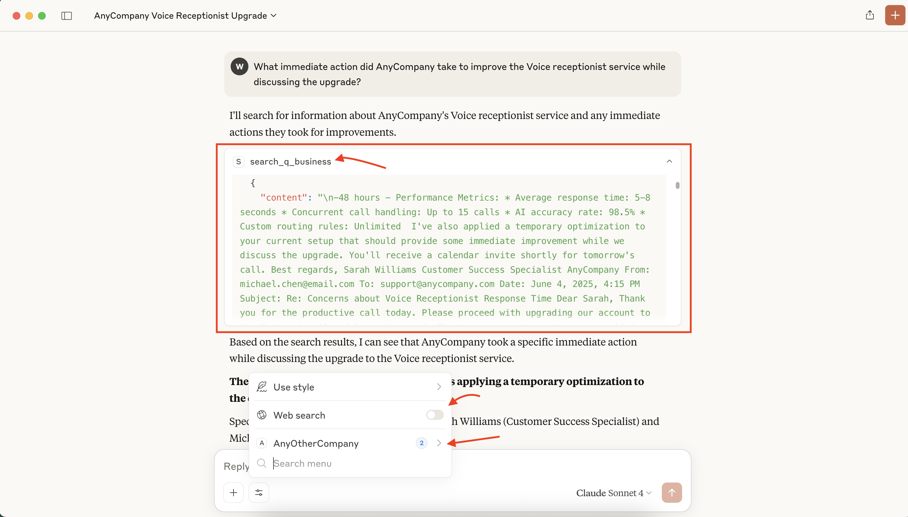
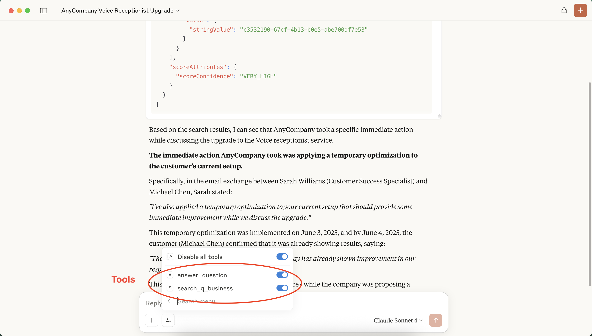

# MCP Server using Amazon Q Business Cross App index

This is an MCP (Model Context Provider) server for Acme Company that uses Amazon Q Business' cross-app index.

## Prerequisites

### Upload Data to S3

Upload the files present in `synthetic_data` directory to S3 and use this as data source for Q Business APP you create as part of instructions in TVM Set up.

### (Token Vending Machine) TVM Set up

Set up the `amzn-q-auth-tvm` from repository https://github.com/aws-samples/custom-ui-tvm-amazon-q-business 

Copy the contents of `cdk-outputs.json` generated after successful deployment of `amzn-q-auth-tvm` to `tvm_values.json` file of this repository. No need to configure QUI.

### Configuration

Create .env file in the root of this module.

```shell
touch .env
```

The application uses environment variables for configuration. You can modify these in the `.env` file:

```
REGION=us-east-1
Q_BUSINESS_APP_NAME=REPLACE_WITH_YOUR_Q_BUSINESS_APP_NAME
```

### Setup and Running with UV

This project uses `uv` for dependency management instead of traditional Python venv.

For Mac, you **MUST** run `brew install uv` for smooth MCP experience. Otherwise you may run into [ENOENT challenges](https://github.com/orgs/modelcontextprotocol/discussions/20)

```shell
brew install uv
```


## Running the Server

You can run the server using the provided script:

```bash
./run_with_uv.sh
```

This script will:
1. Create a uv environment if it doesn't exist
2. Install the required dependencies
3. Run the MCP server

### Manual Setup

If you prefer to set up manually:

```bash
# Create and activate uv environment
uv venv .uv
source .uv/bin/activate

# Install dependencies
uv pip install boto3 "mcp[cli]" requests fastmcp httpx python-dotenv

# Run the server
python mcp_server.py
```

## Required Packages

- boto3
- mcp[cli]
- requests
- fastmcp
- httpx
- python-dotenv

## Test Client

```shell
python test_mcp_client.py
```

## Questions to Ask based on tickets in `synthetic_data` directory

```text
What are some of the reasons of keyboard failure?
What are software installation issues caused by?
What is the remediation of password not working?
What do I do if I am unable to access my backup files?

What immediate action did AnyCompany take to improve the Voice receptionist service while discussing the upgrade?
During which hours did Michael Chen notice the most significant delays?
```

## Installing and Configuring Claude Desktop

Download and install [Claude Desktop](https://claude.ai/download)  for your operating system.
Complete the MCP Host setup by following the [For Claude Desktop Users](https://modelcontextprotocol.io/quickstart/user) guide.

Turn off Web Search for grounded responses to the data synced.





